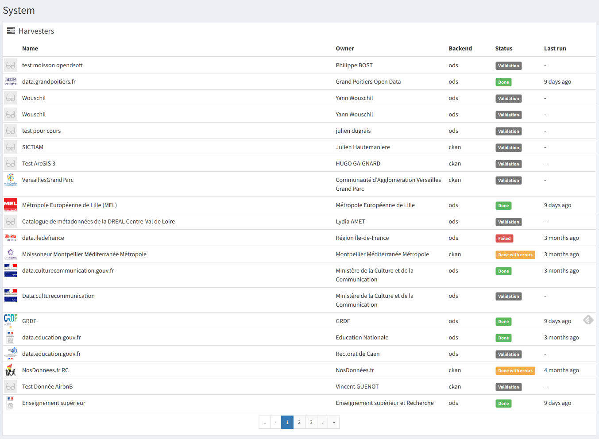
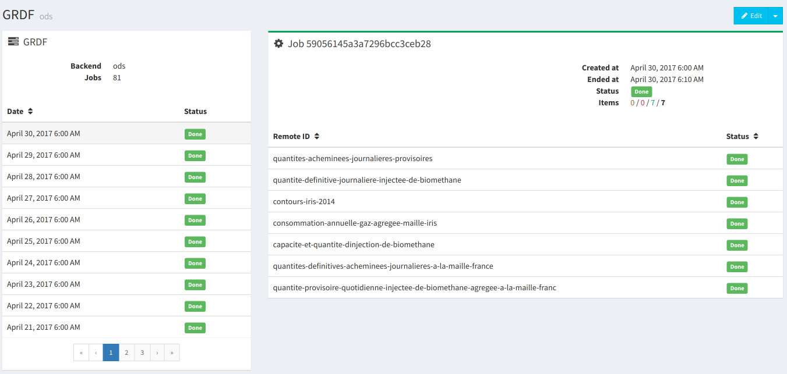

# Harvesting

Harvesting is the process of fetching of automatically remote metadata (ie. from other data portals or not)
and store them into udata for being able to search them.

## Vocabulary

- **Backend**: designate a protocol implementation to harvest a remote endpoint.
- **Source**: it's remote end point to harvest. Each harvest source is caracterized by
  a single endpoint URL and a backend implementation. An harvester is configured for each source.
- **Job**: designate a full harvesting for a given source.
- **Validation**: each created harvester needs to be validated by the admin team before being run.

## Behavior

After an harvester for a given source has been created and validated, it will run either on demand or periodically.

An harvesting job is done in three separate phases:

1. `initialize`: the harvester fetch remote identifiers to harvest and create a single task for each of it
2. `process`: each task created in the `initialize` is executed. Each item is processed independently.
3. `finalize`: when all tasks are done, the `finilize` is a closure for the job and mark it as done.

## Administration interface

You can see the harvester administration interface in the `System` view.



You'll have an overview of all harvester and their state (pending validation, last run...)

Each harvester have a full job history with every remote harvested items.



## Shell

All harvest operations are grouped together into the `harvest` command namespace:

```shell
usage: udata harvest [-?]
                     {jobs,launch,create,schedule,purge,sources,backends,unschedule,run,validate,attach,delete}
                     ...

Handle remote repositories harvesting operations

positional arguments:
    jobs                Lists started harvest jobs
    launch              Launch a source harvesting on the workers
    create              Create a new harvest source
    schedule
    purge               Permanently remove deleted harvest sources
    sources             List all harvest sources
    backends            List available backends
    unschedule          Run an harvester synchronously
    run                 Run an harvester synchronously
    validate            Validate a source given its identifier
    attach              Attach existing dataset to their harvest remote id.
    delete              Delete an harvest source

optional arguments:
  -?, --help            show this help message and exit
```

## Backends

`udata` comes with 3 harvest backends but you can implement your own backend.

### DCAT (prefered)

This backend harvest any [DCAT][] endpoint.
This is now the recommanded way to harvest remote portals and repositories
(and so to expose opendata metadata for any portal and repository).

As pagination is not described into the DCAT specifcation, we try to detect some supported
pagination ontology:
- [Hydra PartialCollectionView][http://www.hydra-cg.com/spec/latest/core/#hydra:PartialCollectionView]

### CKAN (legacy)

This backend harvest CKAN repositories/portals through their API.

### OpenDataSoft (legacy)

This backend harvest OpenDataSoft repositories/portals through their API (v1).

### Custom

You can implement your own backends by extending `udata.harvest.backends.BaseBackend`
and implementing the `initialize()` and `process()` methods.

A minimal harvester adding fake random datasets might looks like:

```python
# -*- coding: utf-8 -*-
from __future__ import unicode_literals

from udata.models import db, Resource
from udata.utils import faker

from . import BaseBackend, register


@register
class RandomBackend(BaseBackend):
    name = 'random'
    display_name = 'Random'

    def initialize(self):
        '''Generate a list of fake identifiers to harvest'''
        # In a real implementation, you should iter over
        # a remote endpoint to list identifiers to harvest
        # and optionnaly store extra data
        for _ in range(faker.pyint()):
            self.add_item(faker.uuid4())  # Accept kwargs to store data

    def process(self, item):
        '''Generate a random dataset from a fake identifiers'''
        # Get or create an harvested dataset with this identifier.
        # Harvest metadata are already filled on creation.
        dataset = self.get_dataset(item.remote_id)

        # In a real implementation you should :
        # - fetch the remote dataset (if necessary)
        # - validate the fetched payload
        # - map its content to the dataset fields
        # - store extra significant data in the `extra` attribute
        # - map resources data

        dataset.title = faker.sentence()
        dataset.description = faker.text()
        dataset.tags = list(set(faker.words(nb=faker.pyint())))

        # Resources
        for i in range(faker.pyint()):
            dataset.resources.append(Resource(
                title=faker.sentence(),
                description=faker.text(),
                url=faker.url()
                filetype='remote',
                mime=faker.mime_type(category='text'),
                format=faker.file_extension(category='text'),
                filesize=faker.pyint()
            ))

        return dataset

```

You take a look at the [existing backends][backends-repository] to see exiting implementations.


[DCAT]: https://www.w3.org/TR/vocab-dcat/
[backends-repository]: https://github.com/opendatateam/udata/tree/master/udata/harvest/backends
